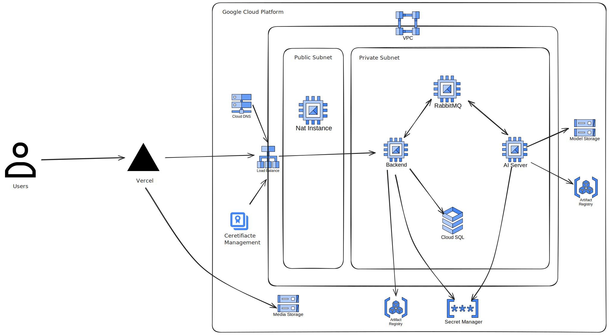

# PBL6 Infrastructure Setup

This repository contains Terraform configurations to set up Google Cloud Platform (GCP) infrastructure. The setup is divided into two main parts: initialization and main module deployment.

## Infrastructure Overview

Below is an overview of the infrastructure set up using this repository:


## Prerequisites

- [Google Cloud CLI](https://cloud.google.com/sdk/docs/install)
- [Terraform](https://www.terraform.io/downloads.html)
- Authenticated GCP account

## Authentication & Config Project

1. Install Google Cloud CLI
2. Authenticate using:
```bash
gcloud auth login
gcloud auth application-default login
gcloud config set project <your-project-id>
```

## Deployment Steps

### 1. Initialization Setup

1. Navigate to the initialization folder:
```bash
cd initialization
```

2. Create `dev.tfvars` with the following required variables:
```hcl
project_name    = "your-project-name"
project_id      = "your-project-id"
project_number  = "your-project-number"
region          = "desired-region"
zone            = "desired-zone"
bucket_name     = "your-bucket-name"
```

3. Apply the initialization configuration:
```bash
# For first time run
terraform init
terraform workspace select [env]
terraform workspace new [env]

terraform plan -var-file="dev.tfvars"
terraform apply -var-file="dev.tfvars"

# Suggest environments
# - dev    (Development)
# - stg    (Staging)
# - prd    (Production)
```

### 2. Main Module Deployment

1. Navigate to the main module directory:
```bash
cd ..
```

2. Create `dev.tfvars` and update all required variables
   
3. Deploy the main infrastructure:
```bash
# For first time run
terraform init
terraform workspace select [env]
terraform workspace new [env]

terraform plan -var-file="dev.tfvars"
terraform apply -var-file="dev.tfvars"
```

## Important Notes

- Ensure all required variables are properly set in the `dev.tfvars` files
- Review the plan output before applying changes
- Keep your credentials secure and never commit them to version control

## Directory Structure

```
.
├── initialization/
│   └── dev.tfvars
├── modules/
│   ├── vm/
│   ├── vpc/
│   ├── .../
│   ├── main.tf
│   └── locals.tf
│   └── output.tf
│   └── variables.tf
├── dev.tfvars
├── main.tfvars
├── version.tf
├── providers.tf
└── variables.tf
```

## License

This project is licensed under the terms specified in the [LICENSE](LICENSE) file.